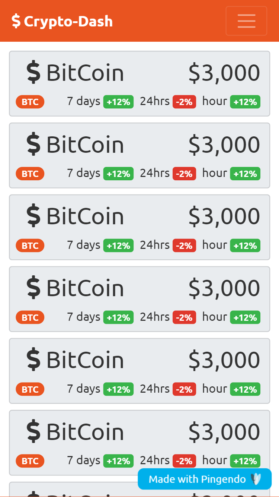
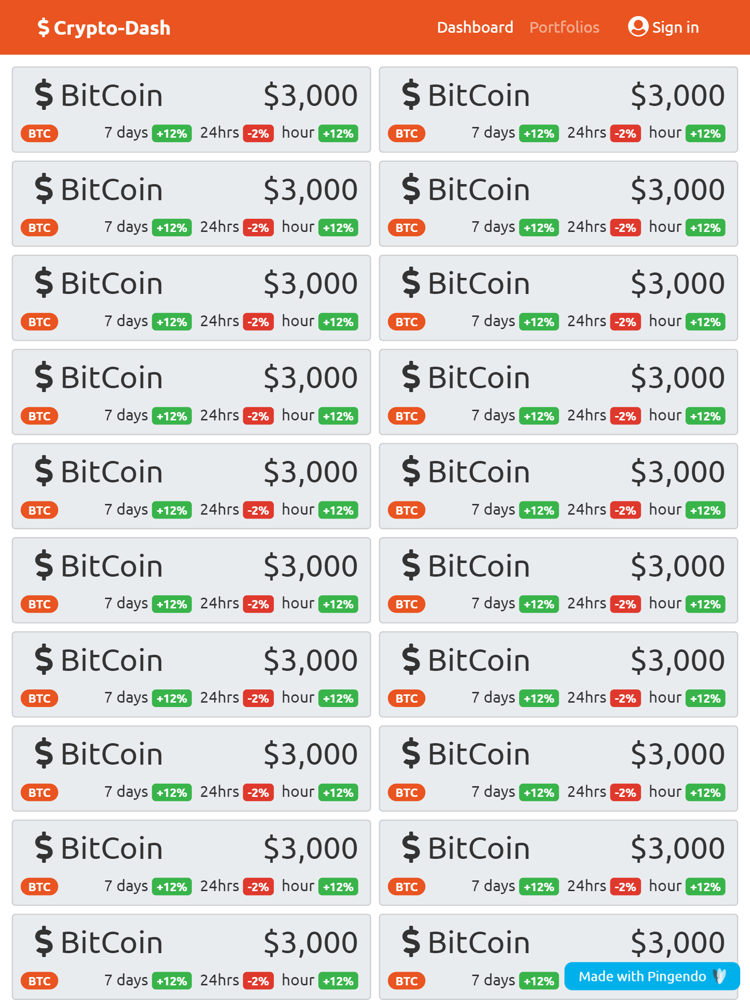
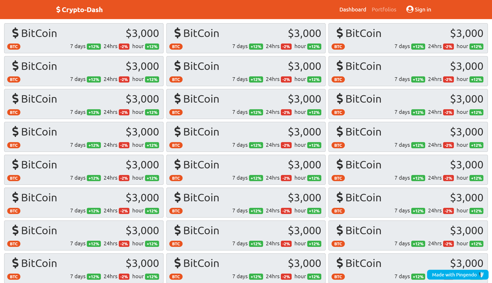
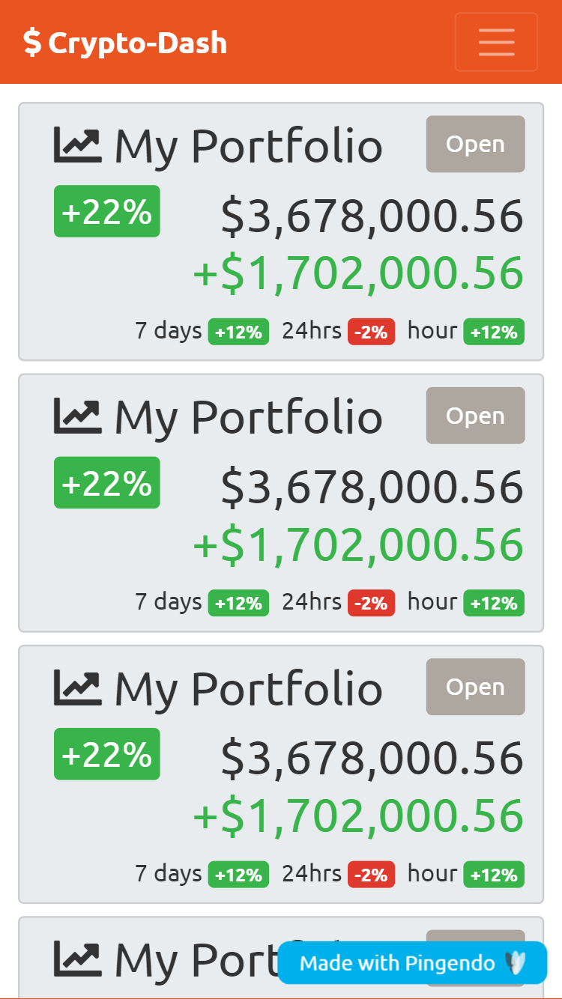
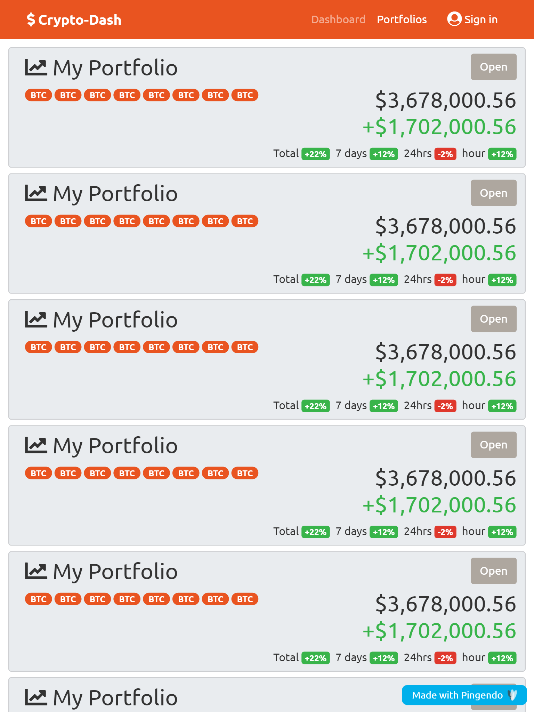
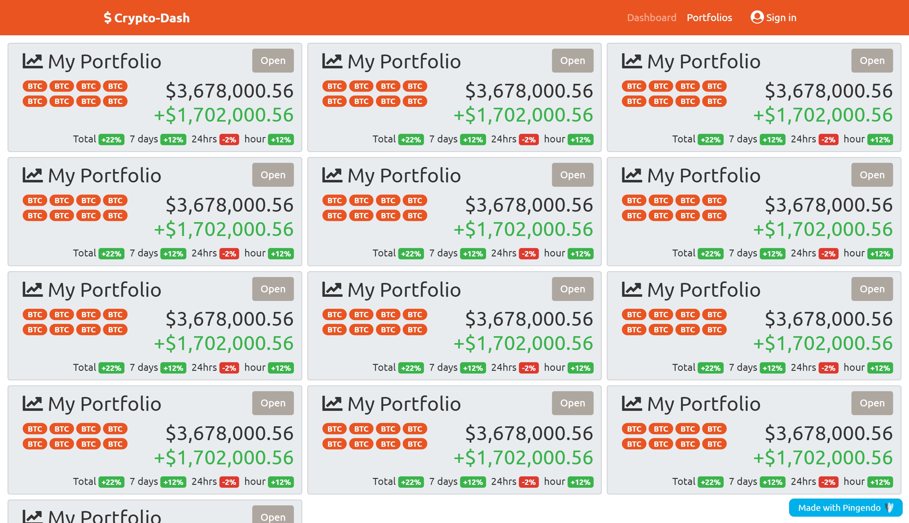
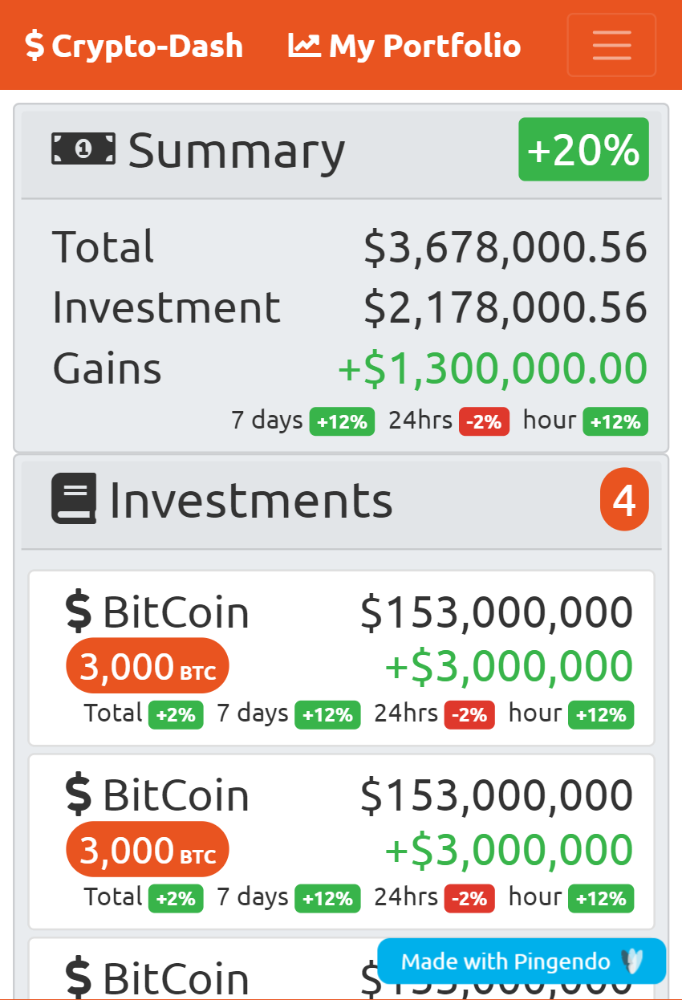
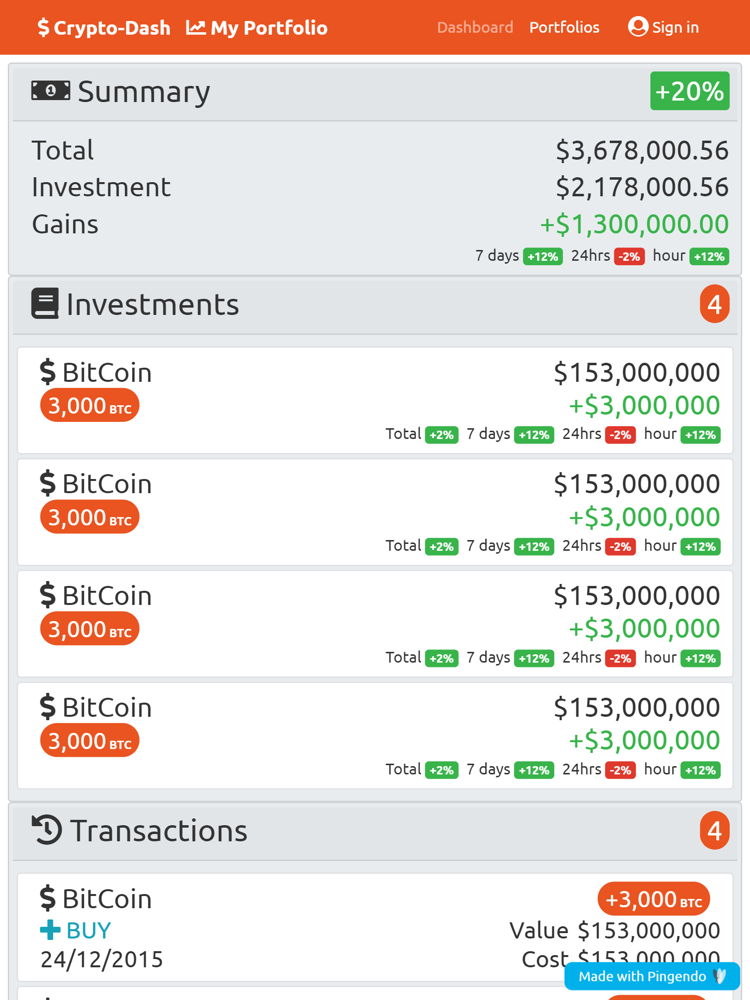
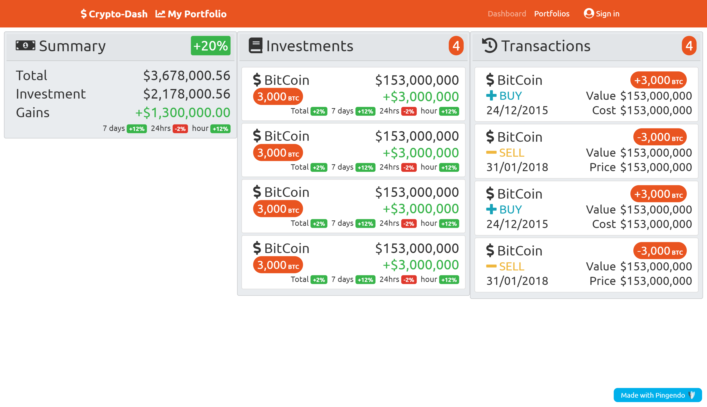

# Mock GUI Design

Mocks generated using Pingendo 4 to visual the concept.

## Dashboard Page

Design Notes:
* Simple card layout for each currency
* Highlight the Currency symbol as primary (tag reference on other pages)
* Icon/Name and Price as Big headers
* Percentages restricted to 2 decimals
* Success markers for positive gains, Danger markers for negative gains.

Mocks:

## Portfolios Page

Design Notes:
* Simple card layout for each portfolio
* Use Currency symbols in highlight for quick at glance currency inclusion
on above mobile viewports
* Name and toolbar on top row
* Show current value and gains
* Percentages restricted to 2 decimals
* Success markers for positive gains, Danger markers for negative gains.

## Portfolio Page

Design Notes:
* Three Sections; Summary, Investments, Transactions
* Mobile retail space limited, design will need work at implementation
* Show current values and gains
* Percentages restricted to 2 decimals
* Success markers for positive gains, Danger markers for negative gains.
* Highlight difference between BUY and SELL transactions

